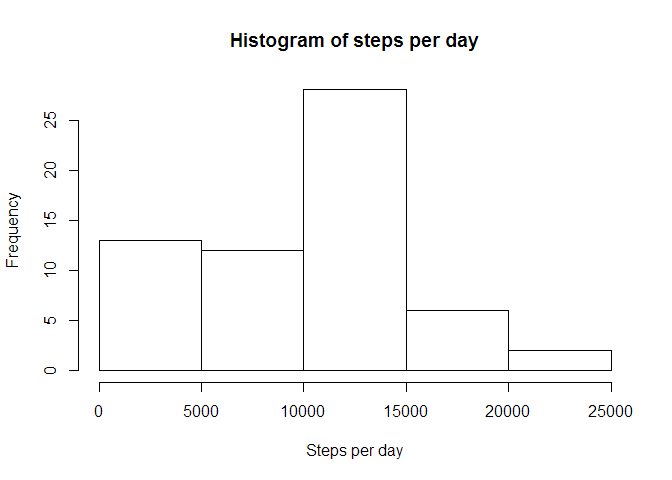
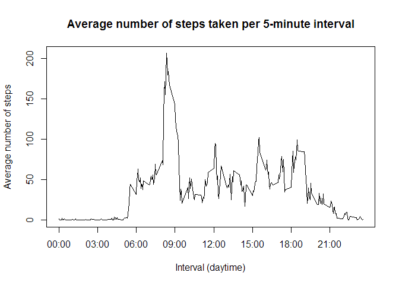
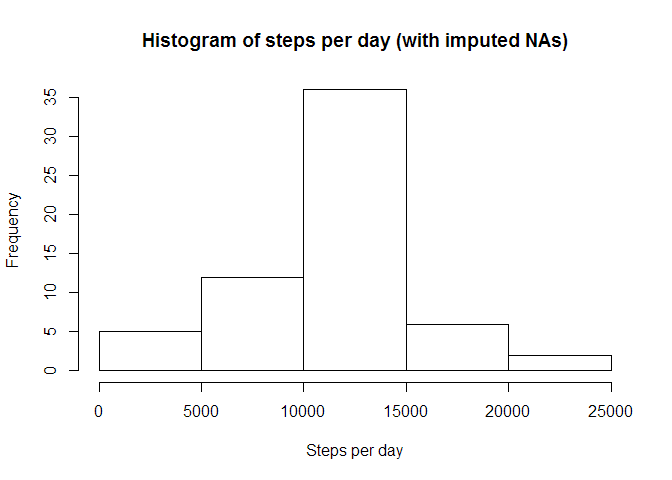
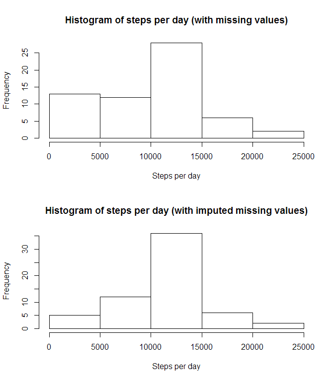
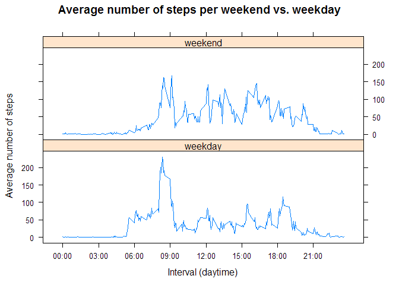

# Reproducible Research: Peer Assessment 1

## Setup of the environment


```r
setwd("C:/_Data/Workspace/Git/RepData_PeerAssessment1")
Sys.setenv(LANG = "en")
Sys.setlocale("LC_TIME", "English")
```

```
## [1] "English_United States.1252"
```


## Loading and preprocessing the data

1. Load the data (i.e. `read.csv()`)


```r
unzip("activity.zip", "activity.csv")
activity <- read.csv("activity.csv")
unlink("activity.csv")
```

2. Process/transform the data (if necessary) into a format suitable for your analysis

I will use the `dplyr` library for the subsequent analyses, so I'm loading it here:


```r
library(dplyr)
```

```
## 
## Attaching package: 'dplyr'
## 
## The following objects are masked from 'package:stats':
## 
##     filter, lag
## 
## The following objects are masked from 'package:base':
## 
##     intersect, setdiff, setequal, union
```

```r
## Format interval as "hh:mm":
activity$daytime <- sub("([[:digit:]]{2,2})$", ":\\1", sprintf("%04d", activity$interval))
```


## What is mean total number of steps taken per day?

Note: For this part of the assignment, missing values in the dataset are ignored.

1. Calculate the total number of steps taken per day


```r
steps_per_day <- activity %>%
                        group_by(date) %>%
                        summarize(steps = sum(steps, na.rm = TRUE))
summary(steps_per_day)
```

```
##          date        steps      
##  2012-10-01: 1   Min.   :    0  
##  2012-10-02: 1   1st Qu.: 6778  
##  2012-10-03: 1   Median :10395  
##  2012-10-04: 1   Mean   : 9354  
##  2012-10-05: 1   3rd Qu.:12811  
##  2012-10-06: 1   Max.   :21194  
##  (Other)   :55
```

2. If you do not understand the difference between a histogram and a barplot, research the difference between them. Make a histogram of the total number of steps taken each day


```r
hist(
        steps_per_day$steps,
        main = "Histogram of steps per day",
        xlab = "Steps per day"
)
```

 

3. Calculate and report the mean and median of the total number of steps taken per day


```r
paste0(
        "Mean number of steps taken per day: ",
        round(mean(steps_per_day$steps), digits = 0)
)
```

```
## [1] "Mean number of steps taken per day: 9354"
```

```r
paste0(
        "Median number of steps taken per day: ",
        round(median(steps_per_day$steps), digits = 0)
)
```

```
## [1] "Median number of steps taken per day: 10395"
```


## What is the average daily activity pattern?

1. Make a time series plot (i.e. `type = "l"`) of the 5-minute interval (x-axis) and the average number of steps taken, averaged across all days (y-axis)


```r
steps_per_interval <- activity %>%
                        group_by(interval) %>%
                        summarize(steps = mean(steps, na.rm = TRUE))
## summary(steps_per_interval)
plot(
        steps_per_interval$interval,
        steps_per_interval$steps,
        main = "Average number of steps taken per 5-minute interval",
        ##xlab = "Interval",
        xlab = "Interval (daytime)",
        ylab = "Average number of steps",
        type = "l",
        xaxt = "n"
)
axis(1, at = seq(0, 2355, by = 300), labels = sub("([[:digit:]]{2,2})$", ":\\1", sprintf("%04d", seq(0, 2355, by = 300))))
```

 

2. Which 5-minute interval, on average across all the days in the dataset, contains the maximum number of steps?


```r
max_interval <- steps_per_interval %>%
                        filter(steps == max(steps)) %>%
                        select(interval)
max_daytime <- sub("([[:digit:]]{2,2})$", ":\\1", sprintf("%04d", max_interval$interval))
paste0("Interval with the maximum number of steps: ", max_interval, " (i.e. at ", max_daytime, if(max_interval < 1200) " a.m." else " p.m.", ")")
```

```
## [1] "Interval with the maximum number of steps: 835 (i.e. at 08:35 a.m.)"
```


## Imputing missing values

Note that there are a number of days/intervals where there are missing values (coded as `NA`). The presence of missing days may introduce bias into some calculations or summaries of the data.

1. Calculate and report the total number of missing values in the dataset (i.e. the total number of rows with `NA`s)


```r
na_count <- sum(is.na(activity$steps))
paste0("Total number of missing values in the dataset: ", na_count)
```

```
## [1] "Total number of missing values in the dataset: 2304"
```

2. Devise a strategy for filling in all of the missing values in the dataset. The strategy does not need to be sophisticated. For example, you could use the mean/median for that day, or the mean for that 5-minute interval, etc.


```r
## As strategy to fill missing values, I use the mean for the respective
## 5-minute interval. For me, this seems better suited than the mean/median
## for the respective day.
##
## The actual replacement of missing values is done in step 3.
```

3. Create a new dataset that is equal to the original dataset but with the missing data filled in.


```r
## Create new dataset as copy of the original "activity" dataset
activity_impute <- activity

## If steps is NA, fill it with the mean for the respective 5-minute interval
activity_impute$steps_impute <- activity_impute$steps
activity_impute[is.na(activity_impute$steps_impute), ]$steps_impute <- steps_per_interval$steps[match(activity_impute[is.na(activity_impute$steps_impute), ]$interval, steps_per_interval$interval)]

## Verify that all NAs are replaced (sum must be 0)
sum(is.na(activity_impute$steps_impute))
```

```
## [1] 0
```

4. Make a histogram of the total number of steps taken each day and calculate and report the mean and median total number of steps taken per day. Do these values differ from the estimates from the first part of the assignment? What is the impact of imputing missing data on the estimates of the total daily number of steps?


```r
steps_per_day_impute <- activity_impute %>%
                                group_by(date) %>%
                                summarize(steps_impute = sum(steps_impute))

summary(steps_per_day_impute)
```

```
##          date     steps_impute  
##  2012-10-01: 1   Min.   :   41  
##  2012-10-02: 1   1st Qu.: 9819  
##  2012-10-03: 1   Median :10766  
##  2012-10-04: 1   Mean   :10766  
##  2012-10-05: 1   3rd Qu.:12811  
##  2012-10-06: 1   Max.   :21194  
##  (Other)   :55
```

```r
hist(
        steps_per_day_impute$steps_impute,
        main = "Histogram of steps per day (with imputed NAs)",
        xlab = "Steps per day"
)
```

 

```r
paste0(
        "Mean number of steps taken per day (with imputed NAs): ",
        round(mean(steps_per_day_impute$steps_impute), digits = 0)
)
```

```
## [1] "Mean number of steps taken per day (with imputed NAs): 10766"
```

```r
paste0(
        "Median number of steps taken per day (with imputed NAs): ",
        round(median(steps_per_day_impute$steps_impute), digits = 0)
)
```

```
## [1] "Median number of steps taken per day (with imputed NAs): 10766"
```

```r
diff_mean <- abs(mean(steps_per_day$steps) - mean(steps_per_day_impute$steps_impute))

paste0(
        "Absolute difference in mean between dataset with missing values (",
        round(mean(steps_per_day$steps), digits = 0),
        ") and with imputed missing values (",
        round(mean(steps_per_day_impute$steps_impute), digits = 0),
        "): ",
        round(diff_mean, digits = 0)
)
```

```
## [1] "Absolute difference in mean between dataset with missing values (9354) and with imputed missing values (10766): 1412"
```

```r
diff_median <- abs(median(steps_per_day$steps) - median(steps_per_day_impute$steps_impute))

paste0(
        "Absolute difference in median between dataset with missing values (",
        round(median(steps_per_day$steps), digits = 0),
        ") and with imputed missing values (",
        round(median(steps_per_day_impute$steps_impute), digits = 0),
        "): ",
        round(diff_median, digits = 0)
)
```

```
## [1] "Absolute difference in median between dataset with missing values (10395) and with imputed missing values (10766): 371"
```

By imputing missing data with the mean for the respective 5-minute interval, the total daily number of steps becomes much more normally distributed as shown by the direct comparison between the two histograms:


```r
par(mfcol = c(2, 1))

hist(
        steps_per_day$steps,
        main = "Histogram of steps per day (with missing values)",
        xlab = "Steps per day"
)

hist(
        steps_per_day_impute$steps_impute,
        main = "Histogram of steps per day (with imputed missing values)",
        xlab = "Steps per day"
)
```

 

```r
par(mfcol = c(1, 1))
```


## Are there differences in activity patterns between weekdays and weekends?

For this part the `weekdays()` function may be of some help here. Use the dataset with the filled-in missing values for this part.

1. Create a new factor variable in the dataset with two levels - "weekday" and "weekend" indicating whether a given date is a weekday or weekend day.


```r
activity_impute$weekday_or_end <- as.character(weekdays(as.Date(activity_impute$date)) %in% c("Saturday", "Sunday"))
activity_impute$weekday_or_end[activity_impute$weekday_or_end == "TRUE"] <- "weekend"
activity_impute$weekday_or_end[activity_impute$weekday_or_end == "FALSE"] <- "weekday"
activity_impute$weekday_or_end <- as.factor(activity_impute$weekday_or_end)
```

2. Make a panel plot containing a time series plot (i.e. `type = "l"`) of the 5-minute interval (x-axis) and the average number of steps taken, averaged across all weekday days or weekend days (y-axis). See the README file in the GitHub repository to see an example of what this plot should look like using simulated data.


```r
library(lattice)

steps_per_interval_impute <- activity_impute %>%
                                group_by(weekday_or_end, interval) %>%
                                summarize(steps_impute = mean(steps_impute))

xyplot(
        steps_impute ~ interval | weekday_or_end,
        data = steps_per_interval_impute,
        type = "l",
        main = "Average number of steps per weekend vs. weekday",
        xlab = "Interval (daytime)",
        ylab = "Average number of steps",
        layout = c(1,2),
        scales = list(
                x = list(
                      at = seq(0, 2355, by = 300),
                      labels = sub("([[:digit:]]{2,2})$", ":\\1", sprintf("%04d", seq(0, 2355, by = 300)))  
                )
        )
)
```

 


## Submitting the assignment


Once the R Markdown file is ready for submitting the assignment, the following code will be manually executed from the R console to produce the PA1_template.md and PA1_template.html files required for Peer Assessment 1.

(Notice the use of rmarkdown::render() instead of knitr::knit2html() in order to use R Markdown version 2 that includes the conversion of the R Markdown "title" variable into the properly formatted title in the md and html files.)


```r
## Set working directory
setwd("C:/_Data/Workspace/Git/RepData_PeerAssessment1")

## R Markdown version 1:
## knitr::knit2html("PA1_template.Rmd")

## R Markdown version 2:
rmarkdown::render("PA1_template.Rmd", "html_document")

## Clean up environment to free up computer memory
rm(list = ls())
```
